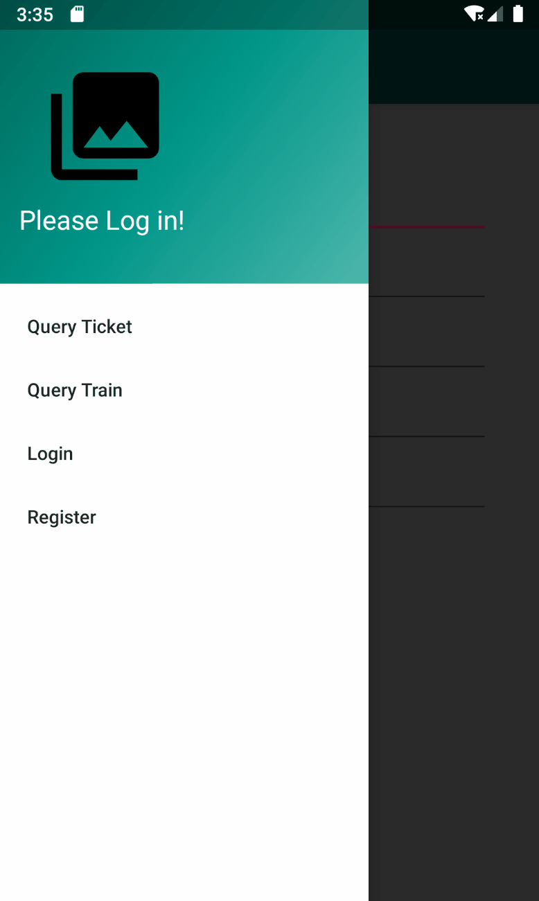
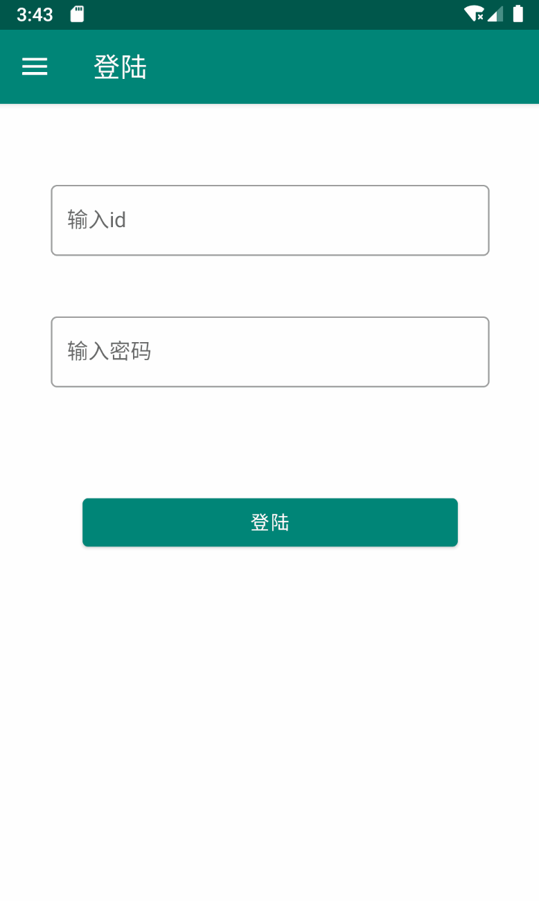
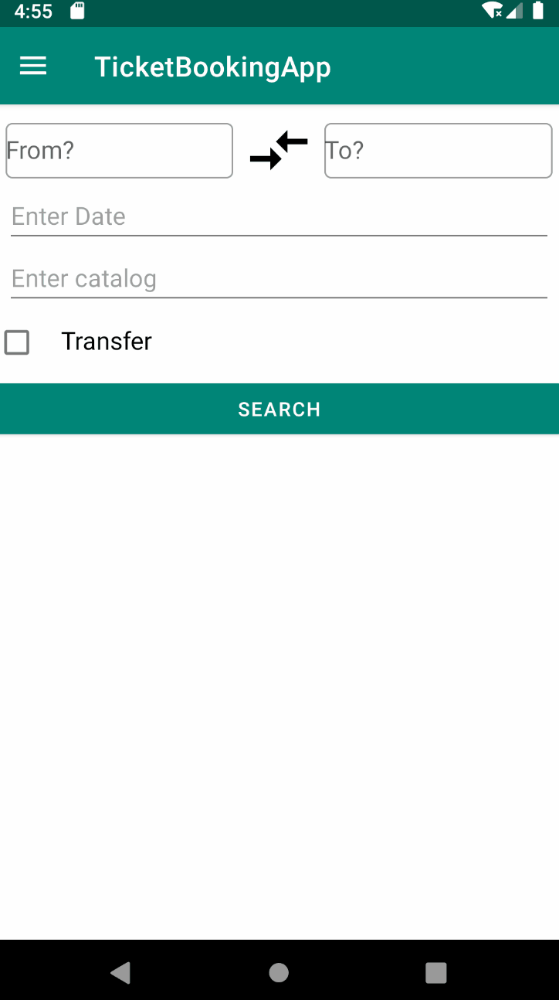
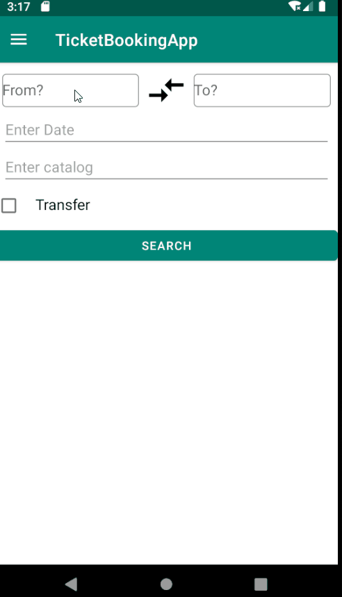
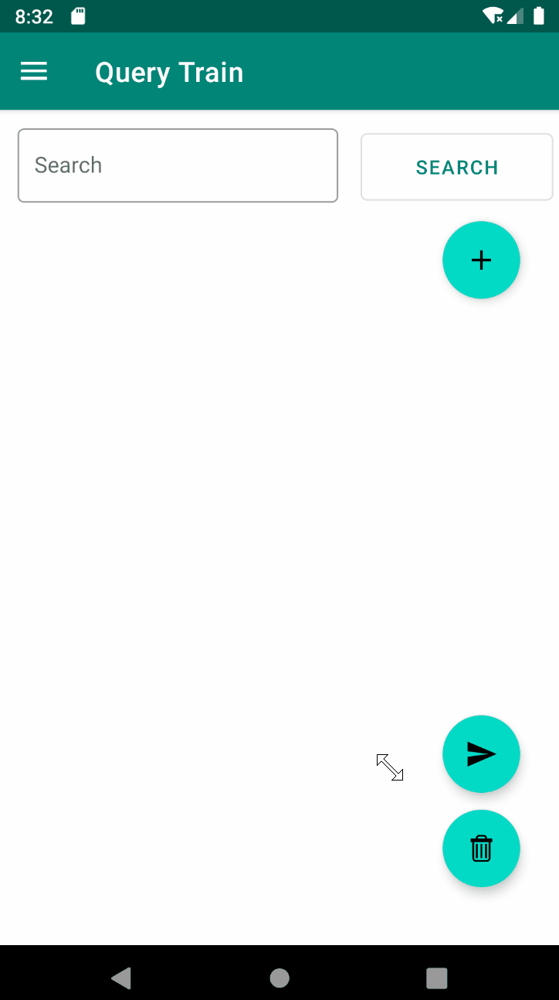
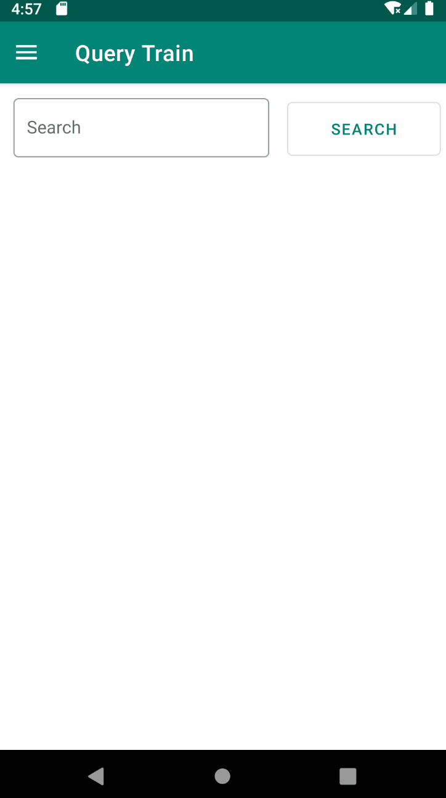
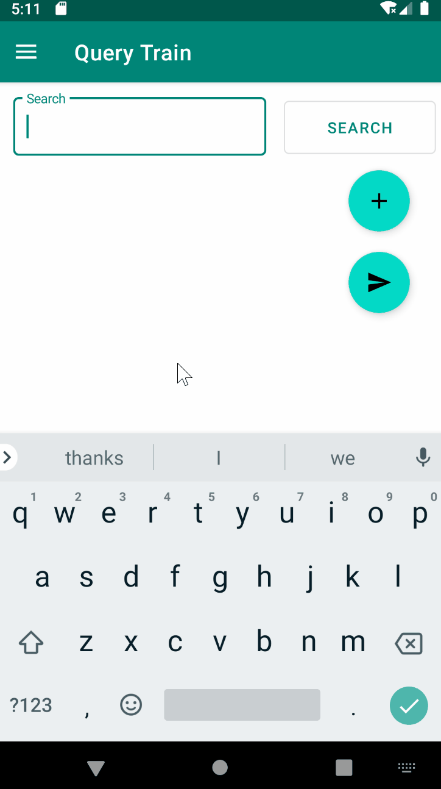
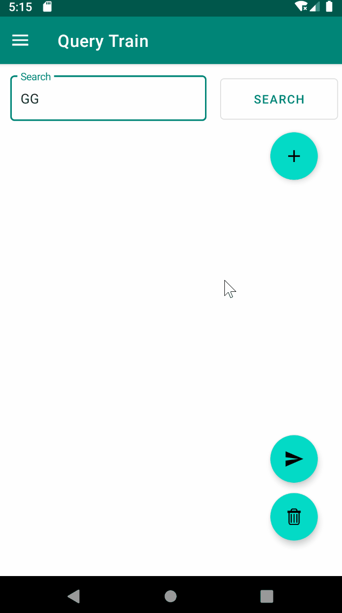

# 火车订票系统Android App用户手册

## 安装方法
打开apk，一路允许就安装完成啦

## 基础操作

1. 注册与登陆
    
    
2. 输入错误提示
    
3. 用户信息更改
    
4. 查询火车票
    
    查询中转车票：
    
    自动补全：
    
5. 退票
    
    购票：
    
6. 查询车次
    
7. 添加与修改车次
    
8. 发售与删除车次
    
    